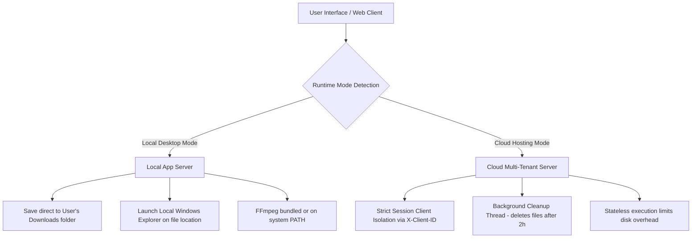

# 🎥 YT Downloader Pro

[](https://www.python.org/)
[](https://flask.palletsprojects.com/)
[](https://github.com/yt-dlp/yt-dlp)
[](https://github.com)
[](https://learn.microsoft.com/en-us/windows/msix/)

**YT Downloader Pro** is an enterprise-grade, high-performance, asynchronous media ingestion and download engine. Built on top of Flask and powered by `yt-dlp`, it offers a modern, high-fidelity responsive user interface featuring glassmorphism design. It functions seamlessly as either a **headless cloud service** (with client isolation and auto-cleanup) or a **portable standalone Windows desktop app** packaged in single-file EXE or signed MSIX configurations.

---

## ✨ Core Features

### 🚀 Asynchronous Multi-Threaded Ingestion

* **Non-Blocking Worker Queue:** Downloads are offloaded to background threads. The Flask server remains fully responsive during heavy download cycles.
* **Real-time Metrics:** Delivers granular, active progress reporting including current download speed, estimated time of arrival (ETA), parsed file size, and completion status.
* **Instant Cancellation:** Safely abort active downloads mid-stream.

### 🎛️ Precision Download Settings

* **Universal Resolution Selector:** Automatically extracts and lets users pick from all available stream qualities (e.g., 4K, 1440p, 1080p, 720p, 480p).
* **High-Fidelity Audio Extractor:** Converts videos to MP3 with configurable bitrates (320kbps, 256kbps, 192kbps, 128kbps) using FFmpeg.
* **Metadata & Artwork Integration:** Downloads thumbnails and embeds them directly as ID3 tags/artwork inside the output MP3 file along with original chapter tags.
* **Time Trimming:** Trim video/audio to specific timecodes (e.g. `00:30` to `02:15` or seconds) so you only download the snippet you need.
* **Subtitles Integration:** Detects and downloads multi-lingual English, French, Spanish, or German subtitles and auto-converts them into standard SRT formats.

### 📂 Advanced Playlist & Bulk Download Engine

* **Interactive Playlist Parser:** Displays all entries in a playlist with durations and thumbnails.
* **Bulk Checkbox Selection:** Select/deselect individual entries and download the batch concurrently with unified quality parameters.

### 🔍 Direct YouTube Search & Recommendations

* **Dynamic Scraper:** Type search keywords directly in the URL bar to query YouTube and return rich search cards.
* **Trending Recommendations:** Auto-scrapes and caches the top 15 trending songs and 15 trending videos globally with background update loops.

---

## 🛠️ System Architecture

YT Downloader Pro features a **Dual-Mode Engine** optimized for different runtime environments:



### 1. Local Desktop Mode

* Launches in a single-user sandbox.
* Persists history and user configurations inside the user's home folder directory: `~/.yt_downloader_pro/`.
* Allows mapping custom directories, checking write access on the fly, and direct integration with Windows Explorer to highlight downloaded files.

### 2. Cloud Server Mode

* Automatically triggered when running on platforms like Render, Railway, or Google App Engine.
* Employs **Strict Client Isolation** utilizing custom `X-Client-ID` request headers to partition history, active queues, and files.
* Spawns a background maintenance loop that purges files older than 2 hours to prevent disk exhaustion.

---

## 💻 Tech Stack

* **Backend Framework:** Flask 3.0.3 (Python)
* **Ingestion Core:** `yt-dlp` (dynamic format parsing and media extraction)
* **Post-processing:** FFmpeg & FFprobe (stream container merging, audio transcoding, thumbnail embedding)
* **Frontend:** Vanilla HTML5, CSS3 Custom Theme (Glassmorphism, CSS variables, glowing layout, CSS skeleton load states), and Vanilla JavaScript (AJAX, reactive poll queues)
* **Packaging:** PyInstaller, Pillow (visual asset scaler), Windows SDK Packaging Tools

---

## 🚀 Getting Started

### Prerequisites

* **Python 3.8+**
* **FFmpeg:** Highly recommended. If missing, high-resolution merging (above 720p) and MP3 conversion will be disabled.

### Development Setup

1. **Clone the Repository:**

   ```bash
   git clone https://github.com/your-username/yt-downloader-pro.git
   cd yt-downloader-pro
   ```

2. **Create and Activate Virtual Environment:**

   ```bash
   python -m venv .venv
   # Windows:
   .venv\Scripts\activate
   # macOS/Linux:
   source .venv/bin/activate
   ```

3. **Install Dependencies:**

   ```bash
   pip install -r requirements.txt
   ```

4. **Verify FFmpeg Installation:**
   Ensure `ffmpeg.exe` and `ffprobe.exe` are placed in the root directory (for portable bundling) or installed globally on your system PATH.

5. **Start Application:**

   ```bash
   python app.py
   ```

   The application will auto-detect a free port (starting at `5000`) and launch a local web browser window.

---

## 📦 Packaging and Distribution

### 1. Build Single-File Standalone Executable

You can bundle the Flask backend, frontend templates, static assets, and FFmpeg binaries into a single, executable file using:

```bash
python build_exe.py
```

* **Output path:** `static/dist/YT_Downloader_Pro.exe`
* The script automatically bundles templates and assets, and includes local `ffmpeg.exe`/`ffprobe.exe` if present.

### 2. Build Windows Store MSIX Package

For enterprise-level deployment, you can compile and generate a signed Microsoft Windows MSIX package:

```bash
python package_msix.py --version 1.0.0.0 --publisher "CN=YourName"
```

* **Asset Scaling:** Auto-resizes `store_logo_source.png` using Pillow into all standard Windows Tile/Splash Logo dimensions.
* **Manifest Generation:** Creates compliant `AppxManifest.xml` specifying trust layers (`runFullTrust`).
* **Packaging:** Automates compilation via Windows SDK `makeappx.exe` and generates a deployable `.msix` package.

---

## 🌐 API Reference

YT Downloader Pro exposes a full, stateless REST API to drive downloads programmatically:

| Endpoint | Method | Headers | Description |
| :--- | :--- | :--- | :--- |
| `/api/config` | `GET` | - | Returns environment information (`is_local`, `has_ffmpeg`). |
| `/api/suggestions` | `GET` | - | Fetches cached trending recommendations (Query `?force=true` to refresh). |
| `/api/search` | `POST` | - | Queries YouTube search for keyword results. |
| `/api/info` | `POST` | - | Parses metadata, formats, and resolutions for a video/playlist URL. |
| `/api/download` | `POST` | `X-Client-ID` (optional) | Initiates an asynchronous download job. |
| `/api/status/<id>` | `GET` | `X-Client-ID` (optional) | Returns active download progress, speed, ETA, and state. |
| `/api/active` | `GET` | `X-Client-ID` (optional) | Lists all active downloads in queue. |
| `/api/abort/<id>` | `POST` | `X-Client-ID` (optional) | Aborts an active download thread. |
| `/api/history` | `GET` | `X-Client-ID` (optional) | Retrieves download history. |
| `/api/history/<id>` | `DELETE` | `X-Client-ID` (optional) | Deletes a history entry and removes its local file. |
| `/api/open-folder` | `POST` | - | Triggers local file explorer to highlight a downloaded file (Local only). |

### Example Ingestion Request

`POST /api/download`

```json
{
  "url": "https://www.youtube.com/watch?v=JGwWNGJdvx8",
  "type": "mp3",
  "bitrate": "320",
  "embed_metadata": true,
  "start_time": "00:00:10",
  "end_time": "00:01:40"
}
```

---

## 🔒 Security & Client Isolation

When hosted in server mode, client states are separated via a header-based token architecture:

* Clients specify a random uuid in the `X-Client-ID` header.
* Active tasks and files are strictly walled behind this ID.
* The automatic background task deletes files from disk to prevent leakage of temporary content.

---

## 📄 License

This project is licensed under the MIT License - see the LICENSE file for details.
# YT-Download

