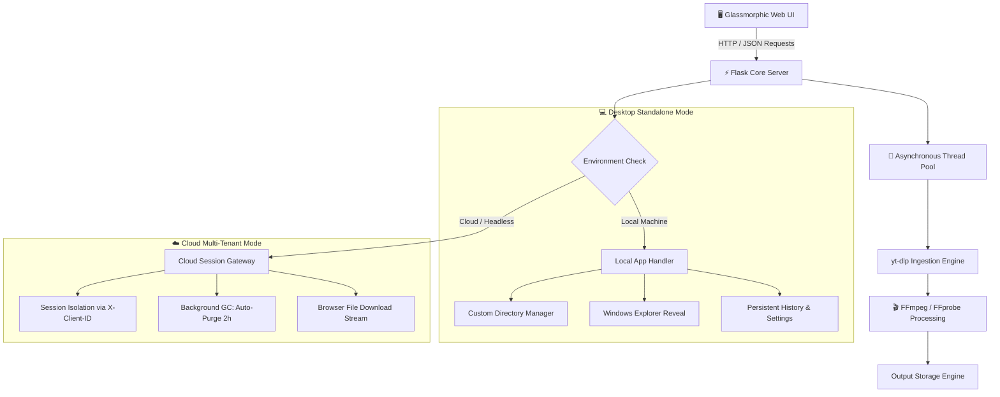

<div align="center">

# 🎬 YouTube Downloader Pro

### *High-Performance, Multi-Threaded Media Ingestion & Transcoding Suite*

[](https://www.python.org/)
[](https://flask.palletsprojects.com/)
[](https://github.com/yt-dlp/yt-dlp)
[](https://github.com/Isura-udith/YouTube-Downloader-Pro)
[](https://learn.microsoft.com/en-us/windows/msix/)
[](LICENSE)

[Features](#-key-features) • [Architecture](#-architecture--dual-mode-engine) • [Installation](#-getting-started) • [Packaging](#-standalone-desktop-packaging) • [API Docs](#-rest-api-documentation) • [Contributing](#-contributing)

</div>

---

## 📖 Overview

**YouTube Downloader Pro** is a robust, full-stack media extraction application engineered for both personal desktop usage and scalable cloud deployments. Combining a responsive **Flask** backend with **`yt-dlp`** and **FFmpeg**, it delivers lightning-fast video and audio conversion wrapped in a sleek, glassmorphic modern web interface.

The application intelligently operates in **Dual Runtime Modes**:
* **Standalone Desktop Mode:** Operates locally on your PC, integrates directly with Windows Explorer, manages custom download directories, and stores logs/history in your user profile.
* **Cloud Multi-Tenant SaaS Mode:** Deploys effortlessly to containerized platforms (Render, Railway, Heroku, Docker) with strict session isolation via `X-Client-ID` headers and automated garbage collection.

---

## ✨ Key Features

<table>
  <tr>
    <td width="50%">
      <h3>🚀 Asynchronous Download Queue</h3>
      <ul>
        <li><b>Non-Blocking Workers:</b> Background thread pool handles concurrent downloads without freezing the UI.</li>
        <li><b>Real-Time Telemetry:</b> Granular live progress, download speed, downloaded size, and estimated completion time (ETA).</li>
        <li><b>Instant Abort:</b> Safely terminate any in-flight download thread at the click of a button.</li>
      </ul>
    </td>
    <td width="50%">
      <h3>🎛️ High-Fidelity Formats</h3>
      <ul>
        <li><b>Ultra HD Video:</b> Stream resolutions up to 4K (2160p), 1440p, 1080p, and 720p with dynamic format selection.</li>
        <li><b>Studio Audio:</b> Extract MP3s at 320kbps, 256kbps, 192kbps, or 128kbps with automatic ID3 tagging and embedded album art.</li>
        <li><b>Video/Audio Snippet Trimming:</b> Cut and download precise time intervals (e.g. <code>00:15 - 01:30</code>).</li>
      </ul>
    </td>
  </tr>
  <tr>
    <td width="50%">
      <h3>📂 Playlists & Bulk Downloads</h3>
      <ul>
        <li><b>Interactive Parser:</b> Inspect playlist tracks with durations, upload dates, and thumbnails before downloading.</li>
        <li><b>Selective Batching:</b> Check/uncheck individual entries and bulk-download with unified quality presets.</li>
      </ul>
    </td>
    <td width="50%">
      <h3>🔍 Search & Trending Discovery</h3>
      <ul>
        <li><b>Integrated Search:</b> Search directly from the top search bar without copying URLs.</li>
        <li><b>Trending Charts:</b> Curated global recommendations featuring the top trending music tracks and videos.</li>
        <li><b>Multi-Lingual Subtitles:</b> Auto-extract subtitles (EN, ES, FR, DE, etc.) converted into standard <code>.srt</code>.</li>
      </ul>
    </td>
  </tr>
</table>

---

## 🏛️ Architecture & Dual-Mode Engine

The application dynamically detects its host environment to configure routing, storage, and file life cycles:



---

## 🛠️ Tech Stack

* **Backend:** Python 3.8+, [Flask 3.0.3](https://flask.palletsprojects.com/), [Flask-CORS](https://flask-cors.readthedocs.io/)
* **Ingestion Core:** [`yt-dlp`](https://github.com/yt-dlp/yt-dlp) (Stream analysis, format resolution, media extraction)
* **Transcoder:** [FFmpeg & FFprobe](https://ffmpeg.org/) (Container multiplexing, audio resampling, metadata embedding)
* **Frontend:** Vanilla HTML5, Modern CSS3 (Glassmorphism, CSS Custom Properties, dynamic animations), Vanilla JavaScript (ES6+, Fetch API, Reactive Polling)
* **Packaging:** [PyInstaller](https://pyinstaller.org/), [Pillow](https://python-pillow.org/), Windows SDK `makeappx` (MSIX)

---

## 🚀 Getting Started

### Prerequisites

* **Python 3.8 or higher** installed on your system.
* **FFmpeg:** Required for merging video+audio streams and MP3 conversions.
  * **Windows:** Download from [gyan.dev](https://www.gyan.dev/ffmpeg/builds/) or install via `winget install Gyan.FFmpeg` (or place `ffmpeg.exe` and `ffprobe.exe` in the project root).
  * **macOS:** `brew install ffmpeg`
  * **Linux:** `sudo apt install ffmpeg`

### Quick Installation

1. **Clone the repository:**
   ```bash
   git clone https://github.com/Isura-udith/YouTube-Downloader-Pro.git
   cd YouTube-Downloader-Pro
   ```

2. **Create a virtual environment:**
   ```bash
   # Windows
   python -m venv .venv
   .venv\Scripts\activate

   # macOS / Linux
   python3 -m venv .venv
   source .venv/bin/activate
   ```

3. **Install dependencies:**
   ```bash
   pip install -r requirements.txt
   ```

4. **Launch the application:**
   ```bash
   python app.py
   ```

The application will find an open port (starting at `http://127.0.0.1:5000`) and automatically launch your default browser.

---

## 📦 Standalone Desktop Packaging

### 1. Build Single-File Executable (`.exe`)
Bundle the entire application (Flask backend, UI assets, templates, and portable FFmpeg binaries) into a self-contained portable Windows binary:

```bash
python build_exe.py
```
* **Output:** `dist/YT_Downloader_Pro.exe`
* Automatically bundles local `ffmpeg.exe` and `ffprobe.exe` if present in the project directory.

### 2. Build Windows Store MSIX Package (`.msix`)
Generate a Microsoft Store-ready MSIX package with scaled visual assets and full trust permissions:

```bash
python package_msix.py --version 1.0.0.0 --publisher "CN=YourPublisherName"
```
* **Output:** `dist/YT_Downloader_Pro.msix`
* Automatically generates multi-resolution application tiles, splash screen assets, and manifest files.

---

## 📡 REST API Documentation

YouTube Downloader Pro exposes a REST API for programmatic media processing:

| Endpoint | Method | Description |
| :--- | :---: | :--- |
| `/api/config` | `GET` | Returns runtime configuration (`is_local`, `has_ffmpeg`). |
| `/api/suggestions` | `GET` | Fetches trending music tracks and videos (`?force=true` to refresh). |
| `/api/search` | `POST` | Searches YouTube with keyword queries (`{"query": "search term"}`). |
| `/api/info` | `POST` | Extracts title, thumbnail, available formats, and durations for a URL. |
| `/api/download` | `POST` | Spawns a background download worker. |
| `/api/status/<id>` | `GET` | Returns real-time percentage, speed, ETA, and worker state. |
| `/api/active` | `GET` | Lists all active and queued download tasks. |
| `/api/abort/<id>` | `POST` | Terminates an active download task. |
| `/api/history` | `GET` | Returns paginated download history. |
| `/api/history/<id>` | `DELETE` | Deletes a history entry and its associated local file. |
| `/api/settings` | `GET` | Retrieves configured download directories. |
| `/api/settings/location` | `POST` | Registers a new download folder destination. |
| `/api/open-folder` | `POST` | Highlights the downloaded file in Windows Explorer (Local mode). |

### Example: Initiate Download Request

`POST /api/download`
```json
{
  "url": "https://www.youtube.com/watch?v=dQw4w9WgXcQ",
  "type": "mp3",
  "bitrate": "320",
  "embed_metadata": true,
  "start_time": "00:00:10",
  "end_time": "00:01:30"
}
```

**Response (`200 OK`):**
```json
{
  "download_id": "7b8f9e20-3a1b-4d6c-8f90-123456789abc",
  "status": "started",
  "message": "Download initiated successfully"
}
```

---

## 🧪 Testing

Run backend test suites using Python's built-in `unittest` runner:

```bash
# Run unit test suite
python -m unittest tests/test_backend.py
```

---

## 📁 Project Structure

```text
YouTube-Downloader-Pro/
├── app.py                   # Core Flask server, routing, and download workers
├── build_exe.py             # PyInstaller compilation and packaging script
├── package_msix.py          # Windows MSIX packager with auto-scaled assets
├── requirements.txt         # Project dependencies
├── settings.json            # Application default settings
├── store_logo_source.png    # High-resolution application brand icon
├── downloads/               # Local download directory (ignored by git)
│   └── .gitkeep
├── static/
│   ├── script.js            # Frontend reactive engine, API client, state management
│   └── style.css            # Glassmorphism styling, animations, responsive design
├── templates/
│   └── index.html           # Main single-page application markup
└── tests/
    ├── test_backend.py      # Core unit tests
    └── test_integration.py  # End-to-end integration tests
```

---

## 🤝 Contributing

Contributions are always welcome! If you'd like to improve YouTube Downloader Pro:

1. **Fork** the repository.
2. Create a descriptive feature branch: `git checkout -b feature/amazing-feature`.
3. **Commit** your changes: `git commit -m 'feat: Add amazing feature'`.
4. **Push** to the branch: `git push origin feature/amazing-feature`.
5. Open a **Pull Request**.

---

## ⚖️ Disclaimer & License

This software is developed for educational and personal archive purposes only. Please respect YouTube's Terms of Service and content creators' intellectual property rights. Ensure you have appropriate rights or permissions before downloading any media.

Distributed under the **MIT License**. See `LICENSE` for more information.

<div align="center">
  <sub>Engineered with ❤️ by <a href="https://github.com/Isura-udith">Isura Udith</a></sub>
</div>